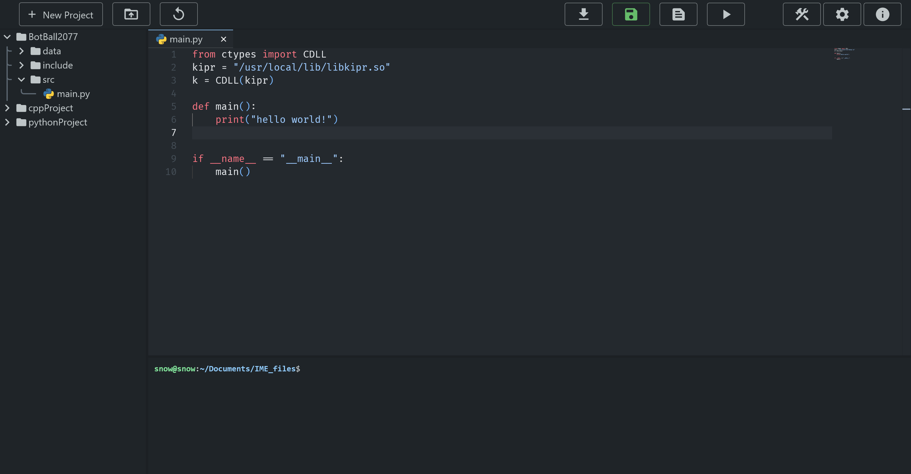

# IHS Monaco Editor (IME)

A custom Monaco-based code editor for IHS Robotics. 

## Installation
First, make the folder where the user generated files will be stored. (note: do not clone the repository into this folder).

`cd ~/Documents && mkdir IME_files`


Before installing, you need to install the Node.js dependencies. 

**Linux (Raspbian/Ubuntu/Debian)**
```
sudo apt-get update
sudo apt-get install -y curl
curl -fsSL https://deb.nodesource.com/setup_20.x | sudo -E bash -
sudo apt-get install -y nodejs
```
**Windows/Mac**

[nodejs download](https://nodejs.org/en/download)

Then, run this command to download the source files.

`git clone https://github.com/ihsrobotics/IHS-Monaco-Editor.git`

`cd` into the cloned directory, and install all the node modules.
```
cd server && npm install
cd ..
cd client && npm install
npm run build
cd ..
```
Note: if you are building on the wombat, it could take over 30 minutes as of v1.0.1. It is recommended to clone the repository on your computer and perform the build there. Then just copy the `dist` folder over to the client directory on the wombat. 

Finally, serve the frontend and backend.

Backend
```
sudo npm install -g pm2
cd server
pm2 start index.js
```

Frontend (you don't necessarily have to use port 3000)
```
sudo npm install -g serve
cd client
serve -s dist -l 3000
```
The app should be up on
http://raspberry-pi-ip:3000.

### Start IME Process on Startup

To start IME on startup on linux, edit the crontab file.
To open the crontab file:
`
sudo crontab -e
`

Then at the first available line, type toe following:
```
@reboot pm2 start <your path>/IHS-Monaco-Editor/server/index.js
@reboot serve -s <your path>/IHS-Monaco-Editor/client/dist -l 3000
```
Replace `<your path>` with the path to the cloned folder (such as ~/Documents).

## Roadmap

- [Monaco code editor](https://microsoft.github.io/monaco-editor/)
- Compile and run button
- Linux terminal
- Custom user settings
- (UNRELEASED) Advanced save features
- (UNRELEASED) Python IntelliSense
- (UNRELEASED) C++ IntelliSense
- (UNRELEASED) Full collaborative editing

